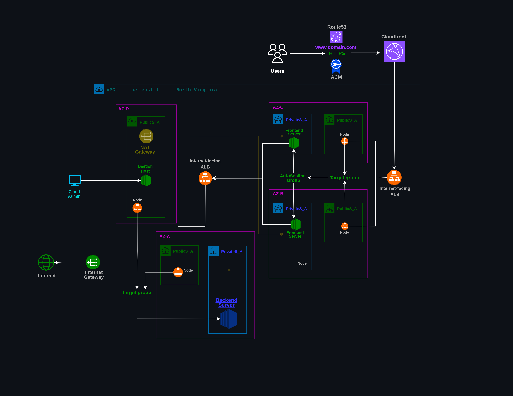
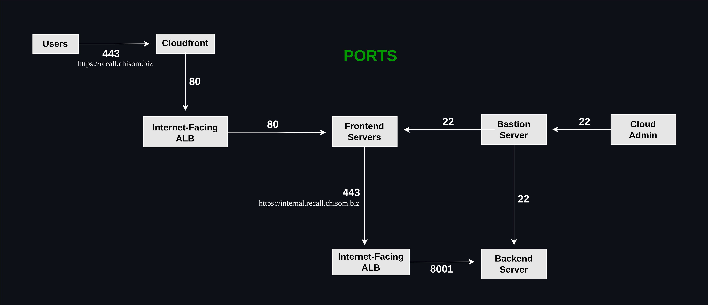

# Architecture

## Quick Links
- **[Root README](../README.md)**
- **Architecture**
- **[How to Run](./documentation/how_to_run.md)**

---

# Recall – AWS Cloud Architecture

Recall is a web-based platform designed to preserve and interact with family memories using AI-powered features. The application consists of a frontend and backend and is deployed on AWS using an automated infrastructure and server configuration process.

The AWS infrastructure is provisioned using **Terraform**, while **Ansible** is used to configure and prepare the EC2 servers. Supporting automation scripts written in **Python** and **Bash** help orchestrate the deployment process.

The architecture includes networking, compute, load balancing, DNS management, SSL/TLS certificates, content delivery, object storage, and server configuration components.

---

## Diagram 1: AWS Infrastructure Plan

The diagram below illustrates the AWS infrastructure used to deploy the Recall application.



---

## Diagram 2: Network Ports and Traffic Flow

The following diagram illustrates the network ports used by the AWS services and application components.

It shows how traffic moves between users, load balancers, frontend servers, backend services, and other infrastructure components.



---

# Tools and Services Used

## Operating Systems

- **Local Development:** Fedora Workstation 44
- **AWS EC2 Servers:** Ubuntu 22.04+

## Scripting and Automation

- **Python** – Deployment orchestration and automation
- **Bash** – Userdata

## AWS Services

- **Amazon EC2** – Hosts the application servers
- **Amazon VPC** – Provides isolated networking infrastructure
- **Elastic Load Balancing (ALB)** – Distributes traffic to application servers
- **Amazon Route 53** – DNS and domain management
- **AWS Certificate Manager (ACM)** – SSL/TLS certificate management
- **Amazon CloudFront** – Content delivery and frontend distribution
- **Amazon S3** – Storage for frontend build files
- **AWS IAM** – Access and permission management

## Infrastructure as Code

- **Terraform** – Provisions and manages AWS infrastructure

## Server Configuration Management

- **Ansible** – Configures EC2 instances and installs required software

## Additional Technologies

- **Docker** – Runs containerized application services
- **Nginx** – Serves the frontend application and handles web traffic

---

## Deployment Automation Overview

The deployment process combines multiple tools:

```text
Configuration
      │
      ▼
Python Deployment Scripts
      │
      ├── Infrastructure preparation
      ├── Frontend & backend build and deployment
      └── Deployment orchestration
      │
      ▼
Terraform
      │
      ├── VPC
      ├── Subnets
      ├── Security Groups
      ├── EC2
      ├── Load Balancers
      ├── CloudFront
      ├── Route 53
      ├── ACM
      └── S3
      │
      ▼
Ansible
      │
      ├── Configure EC2 instances (Frontend and Backend Servers)
      ├── Install required packages
      └── Deploy application files
      │
      ▼
Recall Application
```
