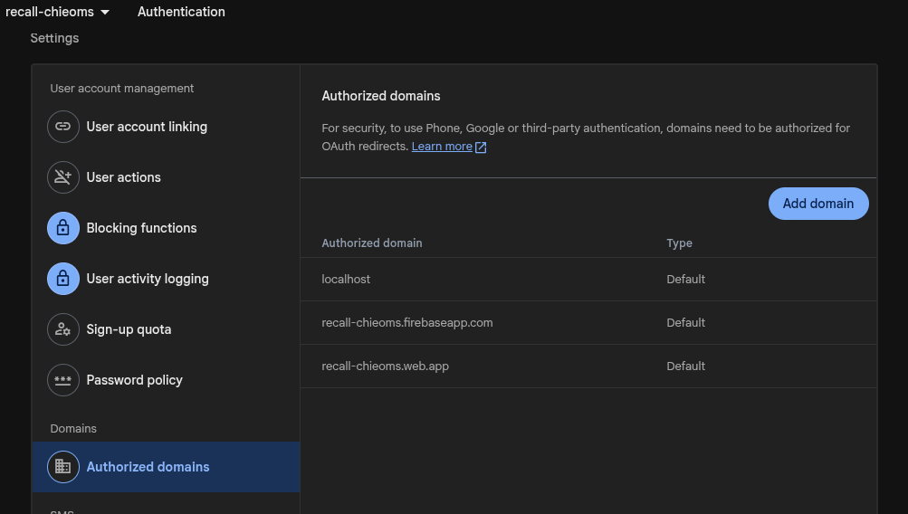
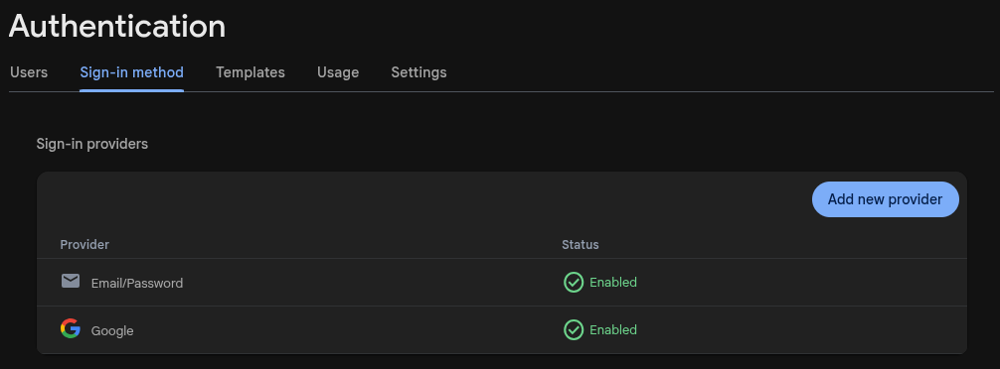

# How to Run

## Quick Links
- **[Root Readme](../../README.md)**
- **How to Run**
- **[Deployend Readme](../README.md)**
- [Setup Script for Ubuntu](./scripts/ubuntu_setup.sh)

---

Follow the steps below to set up and deploy the project successfully.

## 1. Create an AWS Account

If you do not already have an AWS account, create one before continuing.

**AWS Account Registration:**

https://signin.aws.amazon.com/signup?request_type=register

---

## 2. Purchase a Domain Name

Purchase a domain name from any domain registrar, such as:

- Amazon Route 53
- GoDaddy
- Namecheap
- Cloudflare Registrar
- Any other domain registrar

### If You Use Amazon Route 53

Create a **Public Hosted Zone** for your domain.

### If You Use Another Domain Registrar

If your domain is registered with GoDaddy, Namecheap, Cloudflare, or another registrar:

1. Create a **Public Hosted Zone** for your domain in Amazon Route 53.
2. Copy the nameservers provided by the Route 53 Hosted Zone.
3. Update the nameservers at your domain registrar.

This allows AWS Route 53 to manage the DNS records for your domain.

> **Note:** This step is required for this project because Route 53 is used to manage the project's DNS records.

A nameserver configuration walkthrough video will be added later.

---

## 3. Install the Required Tools

An installation script is provided for **Ubuntu 22.04 and later**.

See the installation script:

[Setup Script for Ubuntu](./scripts/ubuntu_setup.sh)

The script installs:

- Python 3
- Git
- Terraform
- AWS CLI v2
- Ansible
- Node.js
- pnpm

---

## 4. Configure the AWS CLI

Create an AWS IAM user with the permissions required to deploy the infrastructure.

Generate an **Access Key** for the IAM user, then configure the AWS CLI:

```bash
aws configure
```

You will be prompted to enter:

- AWS Access Key ID
- AWS Secret Access Key
- Default AWS Region
- Default output format

---

## 5. Clone the Repository

Clone the repository and move into the project directory:

---

## 6. Configure the Project

Rename:

```text
example_recall_config.json
```

to:

```text
recall_config.json
```

Then update the configuration values to match your environment.

The deployment process uses this configuration to generate the required environment variables and configuration for the `frontend` and `backend` directories.

For instructions on running the project locally, see:

- [Root README](../../README.md)
- [Frontend Documentation](../../frontend/README.md)
- [Backend Documentation](../../backend/README.md)

---

## 7. Configure Firebase

Before deployment, configure Firebase Authentication.

### Add Your Domain to Firebase Authorized Domains

Add the domain name used by the project to **Firebase Authentication → Settings → Authorized domains**.

`localhost` is included by default for local development.



### Enable Email/Password Authentication

Enable the **Email/Password** sign-in provider:

```text
Firebase Authentication
    └── Sign-in method
          └── Email/Password
```



The Firebase project's service account JSON must also be configured as:

```text
FIREBASE_SERVICE_ACCOUNT_JSON
```

on the backend so that it can verify Firebase ID tokens sent by the application.

You can find the Firebase Web App configuration under:

```text
Project Settings
    └── General
          └── Your apps
                └── Web app
```

---

## 8. Deploy the Infrastructure

Once the required tools and configuration have been completed, run:

```bash
python3 main.py
```

The deployment script automates the deployment process and will:

- Provision the AWS infrastructure
- Configure the EC2 instances
- Build and deploy the frontend
- Configure the required services
- Deploy the application

---

## 9. View Deployment Logs

Deployment logs are available in:

```text
deployend/logs/
```

These logs can be useful when troubleshooting deployment or configuration issues.

---

## 10. Destroy the Infrastructure

To remove the AWS resources created by the project, run:

```bash
python3 destroy.py
```

This script should be used when you want to clean up the infrastructure created during deployment.

---

# Important Notes

- Ensure that the domain name used by the project is added to **Firebase Authorized Domains**.
- Ensure that **Email/Password & Google** authentication is enabled in Firebase Authentication.
- Ensure that the correct Firebase service account configuration is provided to the backend.
- Make sure your AWS CLI credentials are configured before running the deployment script.
- Make sure your S3 Bucket and Route 53 Hosted Zone is correctly configured before deployment.

# Caution

> **Do not manually delete files or directories created and managed by the application.**

- Avoid manually deleting files listed in `.gitignore`, as some of them may be automatically generated and required by the deployment process.
- Do not manually remove AWS resources created by the project unless necessary.
- Use the following command to remove the infrastructure:

```bash
python3 destroy.py
```

Using the project's cleanup script helps ensure that resources created during deployment are removed in the expected order.